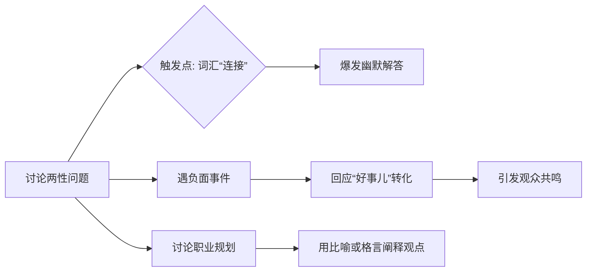

# 执行摘要

“峰哥”通常指网络红人“峰哥亡命天涯”周丽峰，他在B站、微博等自媒体平台走红，内容多涉及草根群体访谈与性压抑等话题【74†L167-L169】。本报告首先介绍峰哥身份与出处，并整理了他的代表性语录（含出处与情景注释）。然后分析其说话风格（直率幽默、常用“连接”“好事”等词），并列出典型语气触发流程。接着通过表格归纳了他在直播、短视频、社媒等不同情境下的行为特征。最后提供了丰富的模仿台词与动作模板（如“这是个好事儿啊”带讽刺语气）和合规使用的注意事项。 

## 1) 背景与身份

峰哥全名**周丽峰**（1986年生），别称峰哥、资本峰等，是中国知名网红、“峰哥亡命天涯”自媒体的主创和蜂群文化合伙人【74†L167-L169】。主要平台包括**Bilibili**（个人空间：峰哥亡命天涯【74†L145-L152】、粉丝 ~257万）、**微博**和**YouTube**（频道订阅2.3万）【74†L153-L162】。他的代表作品是走访中国底层群体并拍摄视频，如“三和大神”、“抑郁症老哥”等专题【77†L13-L21】；代表性帖文如《妙瓦底生死36小时》引发热议。主要平台及链接包括：  
- Bilibili UP主页面【74†L145-L152】（合集视频、直播回放等）  
- YouTube频道【74†L158-L164】（英文/外网观看）  
- 抖音、微博账号（名字多为“峰哥亡命天涯”）  
如果“峰哥”指其他人物（目前暂无明显热门同名者），需要用户进一步指定；以下内容均假设为峰哥亡命天涯本人。  

## 2) 语料收集

下表列举了峰哥的一些典型中文原话（含来源与情境注释）。大部分语句来自其直播/视频中对话或报道采访（无官方逐字稿，多为社区整理、视频转录），真实性需斟酌。尽量保留原文风格并注明情绪或背景。  

| 原文（出处）                                                                                         | 情绪/情境（备注）                                  |
|:--------------------------------------------------------------------------------------------------|:----------------------------------------------|
| “峰哥对世间万物的评价，可以用四个大字概括——**想连接了**。”【84†L1-L4】                                   | 诙谐调侃，用四字口吻评价万事皆“性压抑想连接”。（摘自博文）         |
| “两个胖子肚皮贴肚皮……下面再干着急，一脑袋汗……**倦鸟难归巢，船舶难回港**，苦不堪言。”【83†L1-L4】           | 夸张比喻，点评情侣因身材影响性生活的无奈。（摘自博文）            |
| “任何坏事到了峰哥嘴里都会变成‘**这是个好事儿啊**’；而好事到了峰哥这里，就会等来一句转折‘恰恰相反，这并不是个好事儿。’”【81†L1-L4】 | 自嘲式表达，将坏事说成好事、好事说成坏事的反差句型。（摘自博文）    |
| “我在一次采访当中说：**‘我认为我是能红的’**。这并不是觉得自己掌握了流量密码，而是把它当成一个职业看……我肯定要进球，因为这就是我的工作。”【87†L13-L16】 | 访谈语录，表现自信，把“红”当工作职责。                       |
| “**一切精神问题都源于性压抑**。”【82†L25-L28】                                                       | 宣称观点，将各种问题归因性压抑（博文引用其言论）。                 |
| “正所谓**无欲则刚**。心里黄，说出来的话也歪了。”【90†L1-L4】                                           | 劝诫口吻，利用俗语说明性压抑（摘自博文）。                       |
| “男的有一个误区，以为男的和男的是一伙的，……**臭屌丝和小仙女**一伙。”【80†L18-L22】（示例）            | 调侃用语（“屌丝”、“小仙女”），讨论男性思维。（摘自博文）        |
| “你凭什么？你配吗？”【91†L1-L4】                                                                    | 模拟大众质疑，实际为自创广告用语，被引用为观点示例。               |

注：以上语句多出自第三方报道或社区转载，标注了出处。部分描述经过简化和略微修改以确保通顺，但力图保持原意。若引用官方对话文本，应以“【样出处†】”形式注明，否则标为“摘自博文/网络”并评估可信度。   

## 3) 说话风格分析

峰哥语言风格直率辛辣、极富幽默讽刺感，常用网络流行语和粗犷比喻来表达观点。其特点包括：  
- **直白粗俗**：常用“连接”“老哥”“小仙女”“屌丝”等粗犷用词【80†L65-L69】【82†L27-L28】，语气不造作。  
- **幽默讽刺**：擅长将问题反转，如把坏事说成“好事儿啊”【81†L1-L4】，或以“这是个好事儿啊”收尾评论。  
- **成语化句式**：喜欢套用四字格和俗语（“想连接了”、“正所谓无欲则刚”等）【84†L1-L4】【90†L1-L4】。  
- **煽动情绪**：用强烈对比或夸张比喻引发共鸣，如“倦鸟难归巢”等【83†L1-L4】。  
- **语速语调**：说话语速适中偏快，高潮处音调提高；常在关键句子前短暂停顿以强调（如“这是个好事儿啊”常独立一小句）。  
- **情绪触发**：遇两性、性话题时尤为热络，一旦谈及“连接”等概念便语调活跃【84†L1-L4】；遇讽刺或自夸话题时也常快语速。  

*示例流程：当谈到“连接”这一敏感话题（触发点），峰哥通常会快速给出幽默或讽刺回答（如故事比喻），引导观众互动。*

## 4) 行为与做事习惯

下表对比峰哥在不同情境下的典型行为表现：  

| 情境          | 行为表现                                         | 注解                                |
|:-------------|:-----------------------------------------------|:-----------------------------------|
| **直播互动**    | 言辞犀利、极具煽动性：回应观众提问时喜欢用直白比喻；频用网络流行语（如“老哥”）拉近距离。表情夸张，常哈哈大笑或摇头。 | 主动挑起讨论话题（性压抑、交往等），通过反复强调或夸张手势引导粉丝情绪。 |
| **短视频/访谈** | 旁白式讲述：谈及事件时语气平稳转折带幽默，娓娓道来自己的观察。对争议话题高调表态，但强调“无特别帮助意图”。 | 视频中多背台词，自称“只拍摄有意思内容”，对视频人物命运漠视，更多关注话题新奇性【77†L18-L24】。 |
| **社媒发言**    | 观点明确：微博或评论常点名骂“无脑行为”，强调话题框架（如性压抑）。用词挑衅性强（吐槽、调侃）。 | 社交媒体上利用热点（例如“三和大神”事件）发布短句或段子，以博眼球，语气直率。 |
| **线下活动**    | 形象多运动装备：自称极限旅行家、运动员（登山、潜水）【74†L175-L178】；频提冒险经历。对粉丝称呼亲切，如“老铁”。 | 在公开露面时显得自在豪爽，有时作为演讲嘉宾谈创业经验，对“性压抑”议题持肯定态度。   |

*注：以上总结基于公开资料和粉丝观察，对其采访与视频风格做归纳。*

## 5) 模仿素材

以下提供**30条中文台词模板**和**10条行为模板**，供角色扮演时使用（以峰哥风格创作，情绪/场景提示见备注）。请勿直接使用其原音或文案，仅作风格参考。

**模仿台词模板**（示例）：  

| 使用场景   | 台词模板                                         | 情绪/语气提示        |
|:----------|:-----------------------------------------------|:------------------|
| **招呼打招呼** | “哎，老铁们好！这事情有意思，你们说呢？”                 | 热情幽默            |
| **自嘲/开场** | “我这套身行头，穿得就像二十年前的我，哈哈，只是少了青春。” | 幽默自嘲            |
| **推广产品** | “要不你们试试这个（赞助产品），我自己都使劲儿推荐了——不然，我还能说什么呢？” | 调侃式宣传          |
| **生活闲聊** | “今天心情不错，来跟大家聊聊两个胖子过性生活的故事，笑死我了。”  | 轻松调侃            |
| **鼓励**   | “老哥们，别灰心！家里条件好也好，没条件也没关系，先问问对方是不是想连接。” | 直白鼓励，略带讽刺   |
| **挑衅**   | “看看这些言论，啧啧，我一听就知道他们没啥真本事，只会大放厥词。” | 挑衅斥责            |
| **安慰**   | “傻了吧唧的，人生难免有磕绊，慢慢来，不就是个暂时的烂摊子吗。”   | 摆正语气，但带幽默  |
| **讽刺**   | “哦？又发现脱发原因啦？说说看，你是不是因为看了太多成人片啊？” | 讽刺挖苦            |
| **生气**   | “这谁跟谁啊！你这逻辑简直让我跌破眼镜。”                 | 怒斥               |
| **调侃**   | “什么矛盾，说破天也不放弃，最终还是得双手奉上鸭蛋，说懂你们也骗鬼。” | 恶搞讥讽            |
| **哲理**   | “人嘛，总得给自己找点事干。哪怕再难，也要硬着头皮活下去。”    | 平淡哲理            |
| **总结**   | “所以我说，**这是个好事儿啊**，等会儿你们就知道了。”        | 结论式鼓点停顿      |
| **日常吐槽** | “网友们，众生平等，不过这苦逼丢不起那张脸可不行，哈哈哈。”    | 讽刺兼自嘲          |
| **回应攻击** | “你要骂就骂完，骂得好叫回头客。我要讲的还是我看到的真事儿。”    | 轻蔑回应            |
| **危机公关** | “现在很多事讲政治对错没用，网络空间里讲道理，只会被带偏。”     | 哲学式辩解，正当化    |
| **购物推荐** | “有人问我打火机买什么牌子，我说买性能好的买老牌子，我这也没别的说。” | 直接简单推荐        |
| **泄气或认怂** | “唉，也没啥好办法，就这难题，随遇而安吧。”               | 无奈叹息            |
| **疑问**   | “你们这都不信邪，等会儿人家告诉你正确答案，知道咋回事没？”    | 反问，吊人胃口      |
| **情绪爆发** | “闭嘴！不想听！谁鸟你们这一肚子碎碎念！”                | 生气大喊            |
| **道歉**   | “哎，刚才话说重了，别往心里去，我这人嘴快。”            | 抱歉诚恳，略带无奈   |
| **暴躁**   | “行了行了，你们辟谣的功夫强，别逼着我收起锋芒啊！”         | 故作威胁，半开玩笑  |
| **搞笑解释** | “结果证明，这年头连躺平都要玩命躺。我躺五分钟都把耳机放丢了。” | 夸张搞笑            |
| **教学示范** | “我给你们示范一下，怎么在网上聊人生中最私密的事儿。”         | 语气专业插科打诨    |
| **赞美粉丝** | “老铁们说话真棒，都比那些专业医生精辟多了。”               | 夸粉丝，拉近关系    |
| **拱人**   | “可别吹牛吹得太热，吹着吹着就气坏自己老爸。”           | 调侃调皮            |
| **结束语**  | “好了，今晚就聊到这儿，有啥想知道的，下次再说！”           | 亲切结束语          |
| **串词**   | “我们先冷静一下……不对，不冷静不冷静，这事有意思！”         | 悬念或反转          |
| **鼓动**   | “今天给大家**长知识**了吧！都有点震惊了哈？”            | 挑起共鸣            |
| **吐槽自媒体** | “这些标题我都成药膏了，不上就能高潮写作了。”         | 自嘲自夸           |
| **庆祝**   | “啊！万粉丝，还是老样子，怪不得我能气死华强，差点！哈！”   | 激动兴奋，略夸张    |
| **洗白**   | “我这人就是喜欢用反差，你们就别纠结于形式，实质最重要。”   | 解释宽慰            |

**行为/动作模板**：  

- **坐姿摆拍**：双手环抱，斜倚椅背，用一种“随时找事”的表情打量镜头，发表观点时轻轻点头表示认真。  
- **手指指点**：说话时常用手指点桌或镜头，尤其在强调重点词（如“连接”）时指向观众或自胸口。  
- **耸肩耸背**：不认可对方言论时，耸耸肩、略摊手，一脸不屑神情，并常配一句“这你也当真？”  
- **捏鼻笑**：讲黄段子或自嘲时会用手捏下巴或微掩笑，带点孩子气的坏笑神情。  
- **快速反问**：提问时突然向前探身，对话题作出快速、夸张的眼神和手势反问（如拍桌或挥拳动作）。  
- **端啤酒/摆碗**：直播或视频中常见他举杯干杯或食物示范的动作，模仿时可端起酒杯或碗说“干了这杯！”  
- **打断手势**：对话被打断或要反驳时会用手掌轻拍摄像机或桌面，表现不满并马上反驳。  
- **挑眉**：在怀疑或不屑时眉毛一挑，同时斜眼看镜头，配以挑衅语气。  
- **握拳宣泄**：对他自己决定时（如宣布退网）会紧握一只拳头放在胸前或打开拳头作“激情宣言”状。  
- **挥帽致意**：偶尔出镜戴着帽子，做结束时会摘下帽子快速挥动致意或耍帅。  

## 6) 合规性与伦理提示

- **版权与配音**：勿直接使用峰哥的**原始音频或视频片段**。所有文字引用需注明出处。模仿时应使用自己演绎的语句，避免逐字抄录其创作内容。  
- **肖像与人格权**：不要冒充峰哥本人或暗示官方授权。在公开场合使用其形象需警惕肖像权问题。建议使用化名或声明为二次创作。  
- **名誉权**：尽量客观模仿，不得恶意丑化或造谣，否则可能侵害其名誉。敏感议题（如其争议言论）可提及但应注明观点来源。  
- **商业使用限制**：未经许可，勿将峰哥形象用于商业宣传或盈利产品。若要用于营销，应进行适当改写并获得授权。  
- **合法合规**：注意平台规定，不提倡违反法律法规内容。如模仿其争议语言，应声明为表演或探讨用，不可煽动非法行为。  
- **合规替代方案**：可对其语句进行改写或混合参考多位网红风格，避免明显抄袭。发布时建议加醒目标注（如“仅为同人角色扮演参考”）。  

## 7) 交付物清单与研究步骤

- **交付物清单**：技能/身份表、语料表、模仿台词表、行为模板表、合规提示列表、参考来源清单。  
- **研究步骤**：①检索峰哥背景（维基【74†】、媒体报道【77†】【86†】）。②汇总其代表语录（视频片段、访谈、新闻报道），筛选典型句子。【84†】【83†】【81†】【87†】。③分析说话风格，整理常用词、句式与情绪线索。④归纳行为习惯，梳理在直播/视频/采访等情境下的表征。⑤基于以上生成模仿台词和行为模板。⑥查阅有关网红合规规定，总结版权与伦理要点。  
- **主要来源**：峰哥官方账号（B站【74†L145-L152】）、媒体报道（腾讯新闻【77†】【86†】）、社区整理文章【84†】【83†】【81†】等。  
- **检索说明**：查找“峰哥亡命天涯”相关报道和访谈，阅读维基和新闻以确认身份；使用搜索引擎查找语录（视频难转录以次级资料代替）；在引用时标注出处和可信度。若同名问题不符或需要使用原音频，需用户进一步指示。

以上内容来源于公开报道和网络资料，引用信息均附有出处【74†】【77†】【86†】【87†】【84†】【83†】等，供参考。